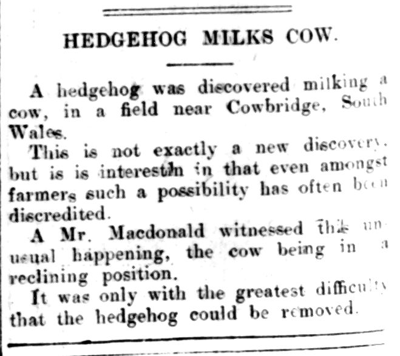

Title: Lucky pigs and little hatreds: on Gaelic terms for hedgehog
Slug: hoganna

I am continuing the theme of researching the creatures that live in my garden.
This time, the humble hedgehog has his moment in the spotlight.

* Gráinneog
    * usage area
    * little hatred?
    * lore:
        * being burned for fun
        * stealing milk
        * sacred?
        * forward mention to lucky piglet
    * horrent -- compare with english
    * fenian cycle and grammatical texts

## Gráinneog nó gràineag: not so hateful after all?

Near-ubiquitous in the returns for the Linguistic Atlas and Survey of Irish
Dialects is the word _gráinneog_. Only two returns in Ireland offer
alternative names, which we will address later. Of the seven Scottish survey
points, only two give a name for the hedgehog, both variants of this word.

The Digital Archive of Scottish Gaelic records usages of this
word in Argyll, North and South Uist, Mull, Easter and Wester Ross, and in Cape
Breton.

I have commonly seen this word translated literally as "little hatred" or "wee
ugly one", given it is formed from _gráin_ ("hatred", "ugliness") and the
diminutive suffix _-óg_. I personally think of the hedgehog as quite charming;
I am delighted whenever I find one in my garden. Such a negative epithet is sad
for me to contemplate. Was the hedgehog really looked upon with hatred by
Gaels of yore?

In an 1840 article in the _Irish Penny Journal_[^penny], an anonymous author defends
the hedgehog from hateful attitudes (a warning for animal cruelty):

> Some twenty years ago it was not unusual in the south of Ireland to see boys
> assembled about a fire of straw, loudly exulting over a flame-surrounded
> victim, whose attempts to escape, rendered nugatory by a timid retraction as
> it were into himself, served but to call forth louder shouts of triumph from
> his persecutors, who thought they justified their savage deed by proclaiming
> its hapless object as a witch, a robber of orchards, and a sucker of cows.

Most of a page is dedicated to clearing "our hero (a name he fully deserves, as
he wins battles by passive resistance)" from these charges.  The charge of
stealing milk by suckling sleeping cows is a popular and perplexing one that
seems to have been believed across these islands[^milk-belief]. I am not alone
in questioning the anatomical feasibility: the above quoted article points to
the structure of the hedgehog's mouth being unsuitable, and the same argument is
made in a more detailed way in Forvague, 1767:

> But a Hedge-Hog has no such Mouth, as to be able to contain the Teat of a
> Cow; therefore any Vacuum, which is caused in it's own Throat, cannot be
> communicated to the Milk in the Dug. And if he is able to procure no other
> Food, but what he can get by sucking Cows in the Night, there is likely to be
> a Vacuum in his Stomach too.

Yet almost two centuries later the idea persisted[^persists]. Despite a 1908
declaration by the British government's Board of Agriculture and Fisheries
that the idea of hedgehogs suckling cows has no basis in fact[^board],
various later news articles report sightings of hedgehogs at the suckling.
Several sources in Ireland's National Folklore Collection mention this
also[^suckling-nfc].

<figure>

<figcaption><i>A 1924 account of a hedgehog seen suckling a cow in South Wales</i></figcaption>
</figure>

A letter in the Western Morning News in 1938 gives a reasonable explanation for
the origin of this curious notion:

> what does happen often, no doubt, is that "piggie" discovers a cow with milk
> running from her udder, and he settles down to lick it as it flows; but in
> doing so he is not robbing the cow, but only utilizing what would otherwise
> be wasted!

The image of the hedgehog gathering apples by piercing them on his spines is
popular across Europe, seemingly having originated in Pliny's Natural History,
some two millenia ago. Jacqueline Borsje[^chulainn] notes the:

> Ra chasnig a folt imma chend imar craíbred n-dergscíach i m-bernaid athálta.
> Ce ro crateá rígaball fó rígthorad immi iss ed mod dá rísad ubull díb dochum
> talman taris acht ro sesed ubull for cach óenfinna and re frithchassad na
> ferge atracht dá fult úaso.

> His hair curled about his head like branches of red hawthorn used to
> re-fence a gap in a hedge. If a noble apple-tree weighed down with fruit had
> been shaken about his hair, scarcely one apple would have reached the ground
> through it, but an apple would have stayed impaled on each separate hair
> because of the fierce bristling of his hair above his head. 

I would suggest that the name is not cruelly insulting the humble
hog, but referring to his spines.

A common variant of the name is _gráinneóg fhéir_, "_gráinneóg_ of the grass",
suggesting other 

## Arkan sonney agus 

[^penny]: B. (1840). An Ghraineog / The Hedgehog. The Irish Penny Journal,
    1(21), 166–167. [https://doi.org/10.2307/30001176](https://doi.org/10.2307/30001176)
[^suction]: [Forvague, S. (1767). A New Catalogue of Vulgar Errors.](https://en.wikisource.org/wiki/A_New_Catalogue_of_Vulgar_Errors)
[^milk-belief]:
[^persists]:
[^suckling-nfc]:
[^spit]: https://www.duchas.ie/ga/cbes/4540666/4362754/4540735
[^board]:
[^chulainn]: Borsje, J. (1994). The Bruch in the Irish Version of the Sunday Letter. Ériu, 45, 83–98. http://www.jstor.org/stable/30007713
