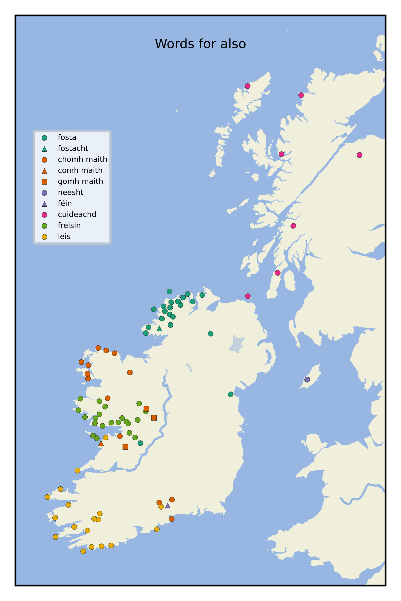

Title: LASID exploration: Gaelic words for "also"
Slug: fosta
Date: 2nd Oct 2026

## Digitising a valuable resource

For a good few months, I have been working on and off on digitising
[Wagner's](https://www.dib.ie/biography/wagner-heinrich-hans-a8837)
Linguistic Atlas and Survey of Irish Dialects, which comprises phonetic records
collected in the 1950s and 60s. You can read more about the previous
digitisation work by others that I am grateful to be building upon, my specific
contributions, and the goals of my work at the [Github
project](https://github.com/lochsh/lasid).

It will take a while for my vision for the LASID digitisation project to be
fully realised, but in the meantime I thought it would be fun to publish some
short blog posts on various dialectal observations and analyses, aided by
my digitisation work.

## Map 85: _also_

Map 85 in Volume 1 of the LASID shows the word used for "also" at the various
survey points. The elicitation prompt was "your shirt is dirty too", with the
prior prompt being "my shirt is dirty".

From the plots above, we can see that _leis_ is ubiquitous in Kerry and Cork.
We can interpret this as "with it", i.e. "your shirt is dirty with it [it = my
shirt]".

Further east in Waterford and Tipperary, _chomh maith_ is more common.
This is analagous to English's "as
well". One instance of _féin_ is recorded here, with the full utterance being
"thá mo léine-se salach <b>féin</b>"[^mo]. This is of course more directly
translated as reflexive: "my <b>own</b> shirt is dirty". I don't think we
should take _féin_ to mean "also" generally.[^féin]

We also find _chomh maith_ a little around the border of Clare and Galway, but
_freisin_ is overwhelmingly recorded in Conamara. O'Rahilly derives _freisin_
from _fa ris sin_, which he translates as "moreover"[^rahilly], but from which
the meaning "along with that" can be taken: "your shirt is dirty along with
that [that = my shirt]".

As we move further north to Mayo, _chomh maith_ returns, before we reach
Ulster, where _fosta_ is almost universally recorded. The two exceptions are
the variant _fostacht_ in Ardara, and _cuideachd_ on Rathlin Island, as in the
Scottish survey points.  _Fosta_ is also found just over the border with
Leinster in Omeath, and in one spot in Galway on the border with
Clare[^connacht-fosta].  [Wiktionary](https://en.wiktionary.org/wiki/fosta)
links _fosta_ to _fós_, meaning "yet, still". I can see how this could become
"also", in the sense of an invariant property across compared items. To put it
clumsily: "even though we are considering another item, <b>still</b> the
property holds".

Returning to the term found on Rathlin and in Scotland: alongside the adverbial
usage found in the LASID, _cuideachd_ also means "company", in the sense of
companionship, a meaning shared in Ireland[^cuideachd]. "Your shirt is dirty in
companionship [with my shirt]", perhaps.

On the Isle of Man we find _neesht_ [njɪs], [neːs],
which John Rhŷs derives from _ina ndís_, in Irish orthography, meaning "in
their pair"[^broderick].

Curiously, _go maith_ appears to be recorded in three places around Roscommon
and east Galway. In all of these points, the Gaelic was all
but dead at the time of the LASID. Wagner writes:

of point 26, Careeny:
> None of our informants in this mountain area could speak Irish. We were, however, able to collect a few hundred words and little sentences from them. They must have spoken some Irish in their childhood. The area is situated on the <i>Galway/Clare</i> border.

of point 32, Carrowntarriff:
>This point represents a place in <i>County Roscommon</i>, about eight miles west of <i>Athlone</i>. Professor T. O Máille (Galway) discovered here two native speakers a few years ago. He recorded answers to our short questionnaire on tape. One of the two informants (a) was very good and could answer most of the questions.

of point 33, Camderry, Galway:
> Two fluent Irish speakers were found in this area where Irish must have been alive some twenty years ago. Most of our questions were answered.

Usually, _go maith_ is either the adverb form of "good", i.e. "well", or it is
used to express subjective opinion that something is good. Of course, in
English we say "as well", and the equivalent expression _chomh maith_ has
already been discussed. Is _go maith_ here a corruption of _chomh maith_?
Or a remanant of a lost East Connacht dialectal usage? Have I misinterpreted
the transcriptions (might this be eclipsis _gcomh maith_)?[^go-maith] Searching
elsewhere for written attestations of the same usage of _go maith_ is made
difficult by how common the phrase is in other contexts.

On comparing the LASID results to other sources, we must remember that the
LASID does not mean to suggest that no other words could ever be used in an
area than those given in the survey.  Although _freisin_ is only found in
Galway in the LASID data, [The Schools Collection](https://www.duchas.ie/en/cbes/volumes), whose material was collected
some two decades before the LASID, has some examples elsewhere, though the
vast majority are in Galway, followed by approximately a third as many in Mayo[^freisin]. The obvious
geographical clustering observed on the maps does suggest that, even if other terms were in use at
the survey points, the ones given in the LASID were likely the most
natural for the elicitation.

## Comparing some of the complete utterances

Point 1, Ring, Waterford:
<blockquote>
,hɑː də ˈl′eːn′ɪʃĕ ˈsᴌɑx <b>xuːˈmɑ</b>, 
<i>Thá do léine-se salach <b>chomh maith</b>.</i>
</blockquote>

Point 44, Ros Muc, Galway:
<blockquote>
tɑː də l′eːn′əsə sɑləx <b>fröʃən̠</b> 
<i>Tá do léine-sa salach <b>freisin</b></i>
</blockquote>

Point 70, Glenvar, Fanad, Donegal:
<blockquote>
tɑ də l′eːn′əsə sɑ̣lɑ̣ ˈ<b>fosṭə</b> 
<i>Tá do léine-sa salach <b>fosta</b>.</i>
</blockquote>

Appendix I point e, Lewis, Scotland:
<blockquote>
hɑ ḍə l′eːnəsə sɑ̣ʟəx <b>kụ̈ḍ′ə̆xḳ</b> 
<i>Thá do léine-sa salach <b>cuideachd.</b></i>
</blockquote>

I enjoy seeing commonalities and differences across different parts of
Gaeldom:

* the lenition on _tá_ in the far south of Ireland and the far north of
Scotland[^north]

* the broad _s_ on the emphatic suffix regardless of final consonant, shared
across the points in Galway, Donegal, and Scotland, but not by the one in
Waterford.

* the short length of _á_ in both Donegal and Scotland

* the preservation of the palatalisation of the _n_ in _léine_ in the Irish
  points, lost in Lewis after the preceding front vowel.

In all examples shown here, I note the lenis slender _l_ in _do léine_. An
earlier question in the LASID reveals that without the possessive adjective,
_léine_ starts with a fortis consonant in all but the first point (Ring does not
maintain a fortis-lenis contrast on _l_ sounds[^breatnach]). Compare [ʟ′eːn′ĕ] with [l′eːn′ə] at point 44. It
is enjoyable to see phonetic evidence of lenition not represented in the
orthography[^fortis].

[^mo]: Occasionally the questionnaire is not followed exactly. In this case
this response is listed for prompt 285 ("my shirt is dirty") and translated as
"my shirt is dirty too". The response for prompt 286 ("your shirt is dirty
too") is blank with a note "cf. 285".

[^féin]: If I had been editor of the LASID I would probably have left this off of
the map for "also". I am considering removing the word annotation from my
digitised version &ndash; this is usually what I would do if the phonetic form
shown in the map is for a different meaning than the map is meant to represent.
Usually Wagner makes a note of this, but not in this case.

[^rahilly]: Ó Maolchonaire, F. (1941). <i>Desiderius, Otherwise Called Sgáthán
an Chrábhaidh, by Flaithrí Ó Maolchonaire (Florence Conry) Edited by Thomas F.
O’Rahilly</i>, [page xxxvi](https://archive.org/details/desideriusotherw00conr/page/n45/mode/2up).

[^connacht-fosta]: Of this spot, Lough Attorick, Wager comments: "Only one
speaker has survived in this desolate mountain area. He was by no means fluent
in Irish."

[^cuideachd]: [Ó Dónaill's
dictionary](https://www.teanglann.ie/en/fgb/cuideachta) also defines
_cuideachta_ as "company", in the sense of companionship.

[^broderick]: [Broderick, G. (2019). <i>Prof. Sir John Rhŷs in the Isle of Man (1886-1893): Dictionary</i>. Zeitschrift Für Celtische Philologie .](https://chaucerianmyth.neocities.org/IPA%20Manx%20Dict..pdf)  <https://doi.org/10.1515/ZCPH-2019-0002>

[^go-maith]: The transcriptions recorded for the survey points in question:<ul> <li>26: [go ˈmɑ]</li> <li>32: [gə ˈmɑ]</li> <li>33: [go ˈmaix′]</li> </ul> The pronunciation of _maith_ matches that given in map 240 for points 26
and 33, though point 32 has [mɑih]. I don't see any
reason why there would be eclipsis on _comh maith_, but that could be my lack
of knowledge. The full utterance for point 32 actually looks like _tá
do léinidh salach go maith leis-sean_, though the last word is not included on
the printed map. Point 33 ends with _go maith_, and point 26 does not have
printed responses to the survey, only texts and vocabulary, in which I cannot
find an obvious source for this map entry.

[^freisin]: Galway has by far the most at 1715, followed by Mayo (625) and
Clare (132). We also have Roscommon (32), Cavan (31), Sligo (21), and Kerry
(20). Elsewhere there is a smattering (less than ten instances per county).

[^north]: And, I believe, in the rest of Scotland too.

[^breatnach]: Breatnach, R. B. (2009). <i>The Irish of Ring Co. Waterford: a
phonetic study</i>. Dublin Institute for Advanced Studies. page 49

[^fortis]: Imagine if ⟨l⟩ always represented a fortis variety, whether
word-initially or not, and ⟨lh⟩ represented the lenis variety. Similarly for
⟨n⟩ and ⟨r⟩. Maybe I would enjoy the consistency this would bring to the
orthography (though this is not a complaint, just a pondering).
