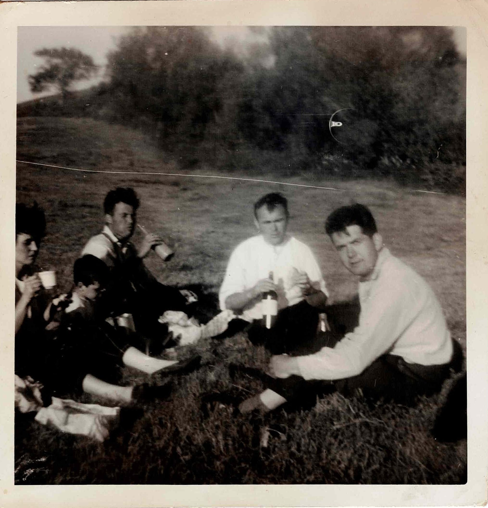
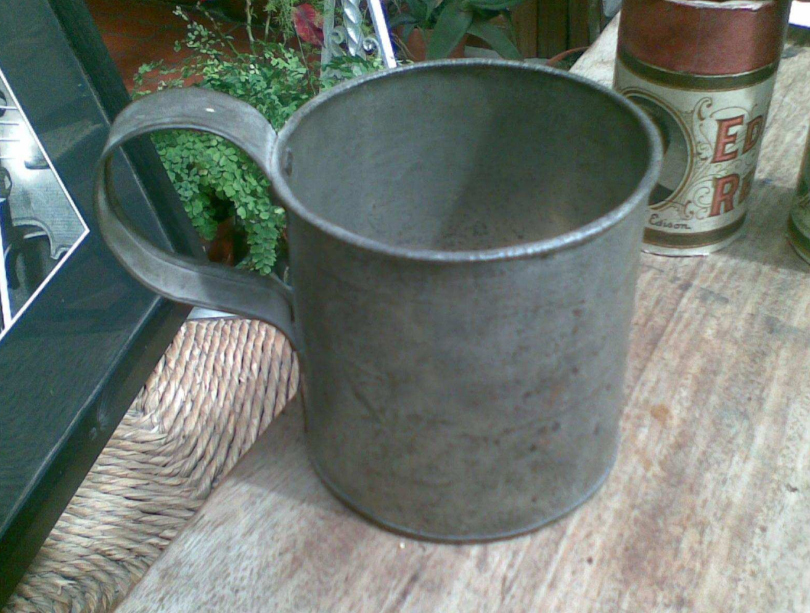

Title: <i>Pandaí</i> or "pandy" for a tin mug or jug
Slug: pandy
Date: 25th Feb 2026

## Childhood memories

My mother was talking about her childhood summers in rural Donegal, and used
the word "pandy" to describe the tin drinking vessels she was often
tasked with bringing to the men out working, along with a pail of water from the
spring well to fill the vessels from. My culturally hungry ears
pricked; could this be a Gaelic word? The initial <i>p-</i> marks it as
a loan word &mdash; but from which language, and with what meaning?

<figure>

    

    <figcaption><i>My grandparents and two of my granny's brothers, with my
    uncle as a young boy. My uncle is drinking from a </i>pandaí<i>. The men, I
    am told, are drinking milky tea from glass bottles.</i></figcaption>

</figure>

The word <i>pandaí</i> does not seem to appear in any major Irish dictionaries,
but searching the digitised parts of Ireland's National Folklore Collection
yields a few usages in Donegal. A selection:

* From [near Creeslough](https://www.duchas.ie/en/cbes/4493635/4406045/4521041?HighlightText=panda%C3%AD&Route=stories&SearchLanguage=ga):

    * <i>Tháinic sí annsin agus shín sí an <b>pandaí</b> dó agus d'ól se achan braon a bhí</i>
    * "She came there and passed the pandy to him, and he drank every drop"

* From [near Kilcar](https://www.duchas.ie/en/cbes/4428319/4394444/4481910?HighlightText=panda%C3%AD&Route=stories&SearchLanguage=ga)

    * <i>Gheibheadh siad baisín céad uair agus cuireadh siad gráinín ann. Go minic
      chuireadh siad dhorn de min bhuidhe fríd. Chuireadh siad gráinín soda agus
      gráinín salainn isteach leobhtha annsin. Chuireadh siad <b>pandaí</b> blaithche
      isteach annsin agus mheasgadh siad na ceithre rudaí le chéile.</i>
    * A description of how to make soda bread; <i>pandaí
      [blaithche](https://en.wiktionary.org/wiki/bl%C3%A1ithche#Irish)</i> = "pandy of
      buttermilk".

<figure>

<figcaption><i>A </i>pandaí<i> made by John Doherty, taken from Conor Thomas
Caldwell's PhD thesis</i></figcaption>
</figure>

My family only called the small drinking vessels "pandies", with
larger tin vessels (as used for getting water from the well or collecting milk
from the cows) called pails or buckets. There are examples of "pandy"
also being used for these larger vessels:

* [near Glendowan](https://www.duchas.ie/en/cbes/4481744/4408451/4481256?HighlightText=pandy&Route=stories&SearchLanguage=ga)
    * "When a heifer calves you are to put a palm branch and a penny at the
    bottom of the <b>pandy</b> when you are milking her for the first time. This
    saves her from witchcraft."

These corroborating examples are pleasing, but do not get us any closer to
understanding the origin of the word. There are a few usages of the word with divergent
meanings that perhaps hold the key: in Munster, "pandy" appears to refer
to
[mashed
potatoes](https://www.duchas.ie/en/cbes/4921760/4904208/5215639?HighlightText=pandy&Route=stories&SearchLanguage=ga)
(see ["poundies"](https://en.wikipedia.org/wiki/Champ_(food)) in Ulster[^champ]), and
[some](https://www.duchas.ie/en/cbes/4493627/4405070/4514525?HighlightText=pandy&Route=stories&SearchLanguage=ga)
[sources](https://www.duchas.ie/en/cbe/9001854/7191125?HighlightText=pandy&Route=items&SearchLanguage=ga) also use it to refer to receiving a beating. In fact, we find a version
of <i>pandaí</i> with slenderised consonants as <i>peaindí</i>[^peaindí] in [Ó Dónaill's
dictionary](https://www.teanglann.ie/en/fgb/peaind%c3%ad), with meanings "tin
mug" and "mashed potatoes (with milk and butter)".

What do tin mugs, mashed potatoes, and physical beatings have in common? The clue
is in the Ulster word "poundies" for mashed potato with sybies: all three
involve pounding! Tin mugs are hammered into shape, potatoes are pounded
into mash, and alas schoolchildren of yore were routinely whacked. It would
seem to me that "pound" was borrowed into Irish to make <i>pandaí</i>, where in
this instance the suffix <i>-aí</i> makes it "thing that is pounded" or
(pleasingly) "poundee" &mdash; and then
from there it was retained in some Hiberno-Englishes as "pandy".

To demonstrate the pounding: travelling tinsmiths would make things like pandies to sell. You can watch
[Johnny Doherty](https://en.wikipedia.org/wiki/John_Doherty_(musician)) make
one in the 1972 documentary [<i>Fiddler on the
Road</i>](https://digitalfilmarchive.net/media/fiddler-on-the-road-2190):

<iframe width="560" height="315" src="https://www.youtube.com/embed/_8DShjWdGwc?si=ZHG3FISHjfWxEZ9S&amp;start=405" title="YouTube video player" frameborder="0" allow="accelerometer; autoplay; clipboard-write; encrypted-media; gyroscope; picture-in-picture; web-share" referrerpolicy="strict-origin-when-cross-origin" allowfullscreen></iframe>

## An alternative etymology

I was pleased with my above proposed etymology, but a subsequent discovery has
me questioning it.

[Collins' English
dictionary](https://www.collinsdictionary.com/dictionary/english/pandy) defines "pandy" as "(in schools) a stroke
on the hand with a strap as a punishment", and notes the term is primarily used
in Scotland and Ireland[^belt]. The etymology is proposed as deriving from the
imperative <i>pande manum</i>, Latin for "hold out [your] hand".
This seems to have been issued
to pupils by teachers, at a time when Latin was still used in schools, as
described
in James Wilson's [<i>Early Recollections of Life at
King William's
College</i>](https://www.isle-of-man.com/manxnotebook/barovian/n136_103.htm) on The
Isle of Man. Both "pandy" and <i>pande manum</i> are used to refer to this
punishment in various English language texts[^texts].

So did "pandy" come to Irish via this restricted meaning,
and spread in usage to other things that were struck? Or does the word
"poundies" suggest that the usage for mashed potatoes at least evolved
separately? I do stand by the idea that the tin mugs take their
name from being struck during their manufacture, but whether this came from
English "pound" or "pandy" (for a school beating), I cannot say.

## Usages of <i>pandaí</i> or "pandy"

<figure>

<figcaption><i>Map of uses in Ireland of </i>pandaí<i> or "pandy". The markers
have been somewhat roughly placed. The only usages I could find in Scotland or
the Isle of Man were in English and referred to the school punishment.  The
Munster
<a
href="https://www.duchas.ie/en/cbe/9001854/7191125?HighlightText=pandy&Route=items&SearchLanguage=ga">usage</a> for a beating describes a horse's feet crushing a fox as having "made a pandy
of him", which might just be referring to getting mashed like a potato.</i></figcaption>
</figure>

Below is a list of usages of <i>pandaí</i> or "pandy" to mean something along
the lines of "tin mug". All are from Donegal, except one from Mayo.

* In Seán Ó hEochaidh's <i>Sean-chainnt Theilinn</i> (1955), <i>pandaí</i> is
  glossed as "a tin pot", and used in the saying <i>Tá sé go h-oiread an
  <b>phandaí</b></i>. If I understand correctly this means "it's as big as a pandy"
  and is used to describe small tasks, or tasks near their
  completion.

* In Pól Ó Seachnasaigh's [<i>Eagrán de na scéalta idirnáisiúnta
ó na Cruacha Gorma
a bhailigh Seán Ó hEochaidh
do Choimisiún Béaloideasa Éireann
i 1947 agus
1948</i>](https://mural.maynoothuniversity.ie/id/eprint/4505/1/P%C3%B3l_%C3%93_Seachnasaigh_-_Tr%C3%A1chtas_PDF.pdf) (2012), stories collected from the Bluestacks by Seán Ó
hEochaidh are reproduced. Story 26: <blockquote><i>Dúirt an seanduine leis an bhean ar ais
go gcaithfeadh sí éirí, agus an bhó a bhleán, bhí bó ann i ndiaidh breith, agus
<b>pandaí</b> den
bhainne a thabhairt dó, nó nach gcuirfeadh sé isteach an
oíche.</i></blockquote> "The old
man said to the woman again she must get up, and milk the cow, the cow was
after giving birth, and bring a pandy of milk, or he wouldn't pass the night."

* In a song collected in the Bluestacks, published in
  [Béaloideas, Iml. 68 (2000)](https://www.jstor.org/stable/20522563)

* In Gerard Stockman's [<i>The Irish of Achill, Co.
  Mayo</i>](https://www3.smo.uhi.ac.uk/oduibhin/leabharthai/Stockman%20(1974),%20The%20Irish%20of%20Achill,%20Co%20Mayo.pdf) (1974),
  <i>pandaí</i> is glossed as "an aluminium mug"

* In Pádraig Ó Baoighill's writing, including in <i>Srathóg Feamnaí agus
  Scéalta Eile</i> (2001): <i>Ó bhreacadh na maidne bhí fear an oileáin ina
  shuí agus <b>pandaí</b> de tae dhubh déanta aige.</i> "[...] and he made a pandy of black
  tea."

* In Conor Thomas Caldwell's [<i>'Did you hear about the poor old travelling fiddler?' &ndash; The Life
  and Music of John Doherty</i>](https://www.academia.edu/9727990/Did_you_hear_about_the_poor_aul_travelling_fiddler_The_Life_and_Music_of_John_Doherty) (2013)

* In this [inscription](https://www.geograph.ie/photo/2087988) in
  [Edenfinfreagh](https://maps.app.goo.gl/cWbKB7mjWMF1DFJQ6), telling the story
  of John Doherty's brother Mickey escaping violence from Black and Tans by
  making a <i>pandaí</i> on the spot to demonstrate he was just a poor
  tinsmith.

* Diarmuid Ó hAirt's [<i>Cnuasach Conallach: A Computerized Dictionary of
  Donegal Irish</i>](https://web.archive.org/web/20240721234049/http://homepage.eircom.net/~gfg/p.htm)
  defines it as <i>Soitheach stáin</i> ("tin vessel"), and uses sources
  collected from The Frosses, Lettermacaward, and Glencolmcille.

* In these interviews in
  [Teelin](https://www.bealoideasbeo.ie/bealoideas/httpdocs/trascribhinni/piosai/019t041_tr.pdf)
  and
  [Cloghan](https://www.bealoideasbeo.ie/bealoideas/httpdocs/trascribhinni/piosai/045t053_tr.pdf).

* In a song collected in Patrick MacGill's [<i>Songs of
  Donegal</i>](https://upload.wikimedia.org/wikipedia/commons/9/9d/Songs_of_Donegal_%28IA_songsofdonegal00macgrich%29.pdf)
  (1921). Page 19: "In all things handy/Thatching a haystack or mending a
  <b>pandy</b>"

* In Seaghán 'ac Meanman's works, including in <i>Mám Eile as an Mhála
  Chéadna</i> (1954): <i>Níorbh' fhada go dtáinig an chomharsanach a ba
  deirean-naighe a bhí astigh an oidhche roimh ré, agus
  bhí <b>pandaí</b> bainne leis.</i> "[...] and he had a pandy of milk with him."

* In Joy Elliott's [<i>Derby to Donegal &ndash; by
  design</i>](https://louishemmings.com/wp-content/uploads/2016/10/Louis-Joy-A5sLR-29-04-2011.pdf) (2011): "Inside I was invited to a
‘<b>pandy</b>’ of tea. A pandy was a tin mug, usually blackened from
being nudged into the fire, so tea ended up being stewed this
way."

* In Brighid "Biddy" McLaughlin's <i>Tales of a Patchwork Life</i> (2024): "a
  tin <b>pandy</b> made by Irish travellers that my son Johnny still drinks from"

* [Referring to a metal trophy](https://donegalgaa.ie/2023/09/14/calling-on-amateur-photographers-the-inaugural-michael-jack-pandy-competition-awaits-your-entry/)

Other usages can be found by searching [duchas.ie](https://www.duchas.ie). The
[National Corpus of Irish](https://www.corpas.ie/en/cng/?q=pandy) also records
"pandy" in a couple audio interviews that I haven't listed above.

## The panda in the room

I should mention that "panda", for the animals, has been borrowed into Irish
and the plural is <i>pandaí</i>. This is of course unrelated etymologically! 🐼

[^champ]: Personally I've only ever called it "champ". I've seen "poundies" in
Peadar O'Donnell's writing. Possibly it is used outside Ulster too, and it
might not always refer to mashed potatoes and sybies.

[^peaindí]: I haven't found any clear record of anyone using this form for tin
mugs. There are a couple usages of it in [The National Corpus of
Irish](https://www.corpas.ie/en/cng/?q=peaind%C3%AD) but I'm not sure what
they're referring to. The first one is a food, I don't know about the second.

[^belt]: Thankfully corporal punishment was a thing of the past when I went to
school, but my parents both received [the
belt](https://en.wikipedia.org/wiki/Tawse) as punishment. They had no
recollection of the term "pandy" ever being used in relation to it.
It is
[recorded](https://dasg.ac.uk/fieldwork/view/SW52ZXJuZXNzSEJhcnJvbnBlcnNvbmFsbWlzY3xhIHBhbmR5fGlkcDE1NzA0OTk2OHx8cGFuZHxyMnx8fGFsbA==)
in the DASG fieldwork in Inverness.

[^texts]: A non-exhaustive list of usages referring to hitting the hands with a
strap or cane:

    * 1715, Scotland, <i>pande manum</i>: [Sermon preached by Mr. James Rows (sic), in St. Geil's Kirk at Edinburgh](https://en.wikisource.org/wiki/Sermon_preached_by_Mr._James_Rows_(sic),_in_St._Geil%27s_Kirk_at_Edinburgh,_which_has_been_commonly_known_by_the_name_of_Pockmanty_preaching)
    * 1833, Scotland, <i>pandies</i>: John Kennedy's <i>Geordie Chalmers; or,
      the Law in Glenbuckie</i>
    * 1863, England, <i>pandied</i>: Charles Kingsley's [<i>The Water-Babies</i>](https://www.pagebypagebooks.com/Charles_Kingsley/The_Water_Babies/Chapter_V_p12.html)
    * 1917, Ireland, <i>pandies</i>: James Joyce's [<i>A Portrait of the Artist
      as a Young Man</i>](https://archive.org/details/in.ernet.dli.2015.27989/page/177/mode/2up?q=pandies)
