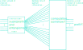
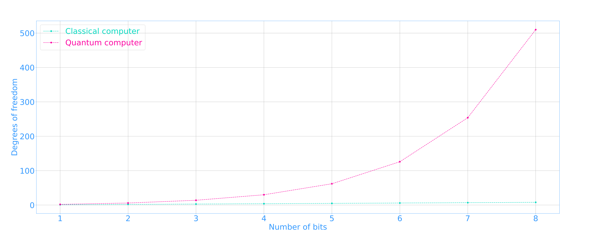
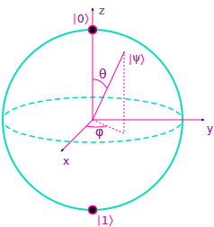
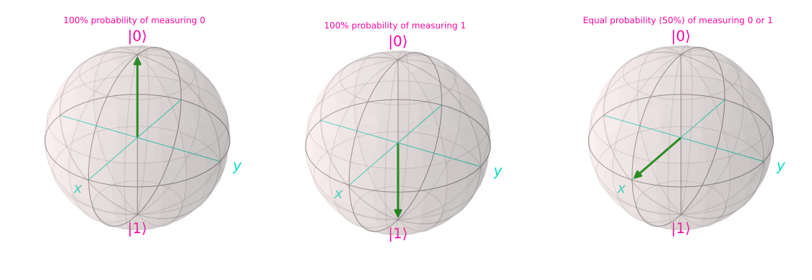
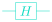

Title: Intro to Quantum Computing
Slug: qc-intro
Date: 27 July 2024
Cover: /images/qc-intro/profit.png

<script>
window.MathJax = {
  loader: {load: ['[tex]/braket']},
  tex: {packages: {'[+]': ['braket']}}
};

MathJax = {
  tex: { inlineMath: [['$', '$']] }
};
</script>

<script id="MathJax-script" async
  src="https://cdn.jsdelivr.net/npm/mathjax@3.0.0/es5/tex-mml-chtml.js">
</script>

I work at a trapped ion quantum computing company writing compiler and control
software in Rust and Python. I've had to learn about quantum computing for my
work, and I have found it hard to find introductory literature that is both
informative and accessible to me.

I thought it would be nice to put together my own introductory guide, and in
the process improve my own understanding. After a lot of reading, and a lot of
questions answered by my excellent colleague Dr Amy Hughes, I've put something
together that covers some of what I was hoping.

I think the first section should be accessible even without much maths or
physics knowledge. After that, some basic linear algebra knowledge will be
helpful, as well as some basic knowledge of atomic structure.

I hope this will elucidate the basic idea of how quantum algorithms work, what
"superposition" and "entanglement" mean and why they are useful, and give a
concrete physical illustration of how these abstract ideas can be realised on
an actual qubit.

## Unpacking the hype

There are two properties of quantum computers that you might have heard about,
expressed variously:

1. Qubits can be in many states at once! Each qubit exists in a _superposition_
of 0 and 1!

2. We can _entangle_ qubits together, so that the state of one qubit determines
the state of others!

Somehow we are to believe that these properties allow quantum computers to be
large and efficient parallel machines. In some sense this is true:
superposition allows quantum computers to explore multiple computational paths
simultaneously, and entanglement creates a state space that grows exponentially
with the number of qubits. But when you measure a qubit, you get a value of $0$
or $1$. So what good are our vast parallelised computations if our output is
compact, encoded in the same binary digits we get out of a classical
computation?

<figure>
    <p align="center">
    
    <figcaption><p align="center"><i>A small amount of classical information becomes a large amount of quantum
information during the quantum computation. But the result is again a small
amount of classic information. How can this be useful?</i></p></figcaption>
    </p>
</figure>

One of the things quantum computers are useful for is extracting some
_property_ of the large superposed state. So rather than quantum computers
being useful for calculating lots of numbers in parallel, they can be useful
for calculating, say, one number that describes some structure in a vast
collection of many other numbers.

_Shor's algorithm_  uses quantum computers in this way. Public-key cryptography
methods such as RSA multiply two large prime numbers together to generate the
encryption key. Those two large prime numbers are kept secret, as the
decryption key can be derived from them. Hence, the security of such encryption
methods relies on it being infeasible for classical computers to find prime
factors of a large integer. In Shor's algorithm, the problem of factoring that
integer is reduced to finding the period of a repeating sequence.  That
sequence is then encoded into the qubits' state and the period is computed as
the compact output of the computation.

Factoring an $n$-bit integer with Shor's algorithm requires something like
$2n + 3$ logical[^1] qubits[^2], depending on the implementation. So for an
2048-bit integer, as often used for RSA keys, something like 5099 logical
qubits would be required. At writing, the most powerful quantum computer in the
world has the equivalent of 20[^3].

### Re-visualising the flow of information

We can now update [our image](#profit) above:

<figure>
    <p align="center">
    
    <figcaption><p align="center"><i>Many quantum algorithms exploit the large quantum state space to encode
information that has some kind of large pattern or structure. That structure is
then efficiently extracted.</i></p></figcaption>
    </p>
</figure>

Importantly, quantum computers are not equivalent to many parallel classical
computers. The quantum state space may be vast, but the result of our
computation is compact. This makes them suitable for computations that can be
formulated into the general structure shown in [the image above](#extract-structure),
but not for simply parallelising many classical computations.

### How exactly do we go from lots of quantum information to a small amount of classical information?

As we've previously stated, when you measure a qubit you get a compact
result of 0 or 1. Before that measurement, we have a great deal more
information. Don't we want that information? How do we distill the information
we're interested in into our compact output?

As we'll explore further in a later section, a qubit's state is expressed using
complex numbers that represent measurement probabilities. A qubit in
superposition is one that has <100% probability of being measured as 0 or 1. If
our algorithm resulted in every qubit having a 50% probability of being
measured as 0 or 1, it would be indistinguishable from noise. So probabilistic
quantum algorithms must manipulate the probabilities such that we have a high
probability of measuring something useful.

Manipulation of qubit state is done via _quantum logic gates_, or simply
_gates_. All gates are linear operators: each output is some linear combination
of every input. So when we perform a multi-qubit gate, each qubit's state
becomes a weighted sum of the input qubit states. When doing this sum, the
qubit states can cancel each other out (destructive interference) or amplify
each other (constructive interference).

We can think of our quantum algorithms as exploring many computational
paths, then pruning off those that aren't of interest, leaving us with a high
probability of measuring the result we desire.

## What does the quantum state actually look like?

### For a single qubit

The state of a single qubit can be described by two complex numbers, which
encode the probability of measuring $0$ or $1$. If you can forgive the
introduction of some notation without it being fully explained, we'll use
$\ket{0}$ to describe 100% probability of measuring $0$, and $\ket{1}$ for
$1$'s equivalent. Our qubit state $\ket{\psi}$ is then described by a linear
combination of these:

$$
\ket{\psi} = a_0\ket{0} + a_1\ket{1}, a_i \in \mathbb{C}
$$

The complex numbers $a_i$ are known as _probability amplitudes_, and
their square magnitude gives the probability of measuring the corresponding
output. For example, the probability of measuring $0$ is given by
${\left|a_0\right|}^2$.

We cannot directly observe the probability amplitudes, only the binary result
of measurement. Why? Intuitively: how could you measure a probability directly?
More honestly: well, why does an electron have charge? There are many things in
the world that we can observe (whether directly or through complex
        experimentation) and describe with mathematics -- but ultimately they
are "just the way it is".

### For multiple qubits

For every $n$ qubits, we have $2^n$ possible measurement outcomes. For example,
for 3 qubits we have possible results of $000, 001, 010, 011, 100, 101,
110, 111$.  Each of these outcomes has a probability amplitude associated
with it:

$$
\ket{\psi} = a_0\ket{000} + a_1\ket{001} + a_2\ket{010} + \dots a_7\ket{111}
$$

Why is it necessary to describe the joint probability distribution across all
qubits? Why can't we factor these into independent distributions for each
qubit, giving us $2n$ probability amplitudes instead of $2^n$?

When qubits are entangled, their measurement outcomes are linked. Therefore,
a general description of the state for multiple qubits must describe a joint
probability distribution over the qubit measurement outcomes, rather than
independent distributions for each qubit.

Hence, entanglement is what creates the exponential growth of the state space
with the number of qubits.

### How exactly does the state scale compared to classical computers?

It's not obvious how best to quantify the difference in scale between our
$\mathbb{C}^{2^n}$ quantum state space and our $\mathbb{Z}_{2}^{n}$ classical
state space . One way we can directly compare them is by considering degrees of
freedom.

In a classic computer, we have as many degrees of freedom as we have bits. You
can fully describe the state of $n$ bits with $n$ values of 0 or 1.

In a quantum computer, the degrees of freedom scale exponentially with the
number of qubits. How?

<figure>
    <p align="center">
    
    <figcaption><p align="center"><i>Comparing how the degrees of freedom in classical and
    quantum computers scale with the number of bits</i></p></figcaption>
    </p>
</figure>

From [our equation for multi-qubit state](#for-multiple-qubits), we know that
the state of $n$ qubits is described by $2^n$ complex numbers. Absent any
constraints, $2^n$ complex numbers would have $2 \times 2^n = 2^{n+ 1}$ degrees
of freedom: each complex number is minimally and fully defined by two real
numbers, an amplitude and a phase. As the square magnitudes of our complex
numbers represent probabilities, we have the constraint
$\sum_{i = 0}^{i = 2^n - 1}\left|a_i\right|^2 = 1$, which removes one degree of
freedom. We eliminate another degree of freedom due to the fact that the
relative phase of $a_i$ are observable, but the global phase of $\psi$ is not:
constraining $a_0$ to be real (or, arbitrarily, imaginary) does not change the
physical meaning of $\psi$. That leaves us with $2^{n+1} - 2$ degrees of
freedom.

### Visualising qubit state

We can visualise a single qubit's state on a unit sphere, known as the Bloch
sphere:

<figure>
    <p align="center">
    
    </p>
</figure>

The qubit's _state vector_ always has magnitude one, hence it always touches the
surface of the unit sphere. The angles $\theta$ and $\phi$ are one way of
expressing our two degrees of freedom. We can write:

$$
\ket{0} = \begin{bmatrix}
           1 \\\\
           0
         \end{bmatrix} \equiv \begin{bmatrix}
                          \cos\frac{\theta}{2} \\\\
                          0
                          \end{bmatrix}
$$

$$
\ket{1} = \begin{bmatrix}
           0 \\\\
           1
         \end{bmatrix} \equiv \begin{bmatrix}
                          0 \\\\
                          e^{i\phi}\sin\frac{\theta}{2}
                          \end{bmatrix}
$$

We will call the states $\ket{0}$ and $\ket{1}$ our _computational basis_, or
simply our _basis states_.

#### But what about visualising multiple qubits?

The Bloch sphere gives us a convenient way of visualising the state of a single
qubit, but what about multiple qubits? As previously described, if there is no
entanglement, then the state of a multi-qubit system can be factored into
separate individual qubit states. In that case, we can visualise the state of
$n$ qubits on $n$ Bloch spheres. If there is entanglement, we cannot factor our
many-dimensional state into multiple 2-dimensional states, and so visualisation
can be challenging. We won't provide any visualisations here, but there are
several proposed methods[^4][^5].

### Manipulating qubit state

Now that we can visualise a single qubit's state on the Bloch Sphere, we can
more easily imagine that state being manipulated. What would it mean for the
state vector to be aligned with the positive $x$ axis? That's $90^{\circ}$
rotated around the $y$ axis from either of our basis states. So it's half way
between them!  This is _superposition_.

<figure>
    <p align="center">
    
    <figcaption><p align="center"><i>Superposition on the Bloch sphere</i></p></figcaption>
    </p>
</figure>

We can write the state vector in terms of $\ket{0}$ and $\ket{1}$:

$$
\ket{\psi} = \frac{1}{\sqrt{2}}\left(\ket{0} + \ket{1}\right)
$$

Remember, the square magnitude of the coefficients of the basis states gives us
the probability of measuring them. In this case,
$\left|\frac{1}{\sqrt{2}}\right|^2 = \frac{1}{2}$: we have an equal probability
of measuring either $0$ or $1$.

Manipulating qubit state is also described as executing a _quantum logic gate_,
or _gate_ for short. We can write a matrix operator for a gate that would take
a qubit from $\ket{0}$ to the superposed state shown in [the images
above](#superposition) (although via a different rotation than described
above):

$$
\frac{1}{\sqrt{2}}\begin{bmatrix}
       1 & 1 \\\\
       1 & -1
     \end{bmatrix}\ket{0} = \frac{1}{\sqrt{2}}\left(\ket{0} + \ket{1}\right)
$$

This gate is known as the Hadamard gate, is shown graphically as a square with
an H in it:

<p align="center">

</p>

### Creating entanglement

Let's demonstrate how entanglement is created between two qubits. Similar to
our [single](#for-a-single-qubit) and [multi-qubit](#for-multiple-qubits)
equations above, if we have two qubits we can write:

$$
\ket{\psi} = a_0\ket{00} + a_1\ket{01} + a_2\ket{10} + a_3\ket{11}
$$

Where e.g. $a_1$ is the probability amplitude associated with measuring $0$
for the first qubit and $1$ for the second. How would we find the coefficients
$\{a_0,a_1,a_2,a_3\}$ given the state vectors of the individual
qubits? For two qubits $c$ and $t$:

$$
\begin{aligned}
\ket{\psi_c} &= c_0 \ket{0} + c_1 \ket{1} \\\\
\ket{\psi_t} &= t_0 \ket{0} + t_1 \ket{1}
\end{aligned}
$$

we compute the state vector $\ket{\psi}$ of the two qubit system using the
tensor product of the individual qubits' state vectors:

$$
\begin{aligned}
\ket{\psi} &= \ket{\psi_c} \otimes \ket{\psi_t} \\\\
        &= \begin{bmatrix}
            c_0 \\\\
            c_1
           \end{bmatrix}
           \otimes
           \begin{bmatrix}
            t_0 \\\\
            t_1
           \end{bmatrix} \\\\
        &= \begin{bmatrix}
            c_0 t_0 \\\\
            c_0 t_1 \\\\
            c_1 t_0 \\\\
            c_1 t_1
           \end{bmatrix}
        = \begin{bmatrix}
            a_0 \\\\
            a_1 \\\\
            a_2 \\\\
            a_3
           \end{bmatrix}
\end{aligned}
$$

We can now apply two-qubit operators to this vector, in the same way we applied
the Hadamard gate matrix to the single qubit state vector. The _controlled NOT_
or _CNOT_ gate operates on two qubits: a control qubit ($c$) and a target qubit
($t$). It is defined by this matrix:

$$
CNOT = \begin{bmatrix}
1 & 0 & 0 & 0 \\\\
0 & 1 & 0 & 0 \\\\
0 & 0 & 0 & 1 \\\\
0 & 0 & 1 & 0
\end{bmatrix}
$$

and performs this transformation:

$$
\begin{aligned}
&a_0\ket{00} + a_1\ket{01} + a_2\ket{10} + a_3\ket{11} \\\\
\rightarrow \hspace{0.5em} &a_0\ket{00} + a_1\ket{01} + a_3\ket{10} + a_2\ket{11}
\end{aligned}
$$

In other words, the probability amplitudes for the measurement outcomes
$\ket{10}$ and $\ket{11}$ are swapped. If the control qubit is purely
$\ket{1}$, then the target qubit is flipped. If the control qubit is purely
$\ket{0}$, then $a_2$ and $a_3$ equal $0$, and there is no effect. If the
controls qubit is in superposition, then the effect on the target qubit will be
correspondingly superposed.

Let's apply a CNOT gate to our qubits $c$ (for control) and $t$ (for target):

$$
\begin{aligned}
\psi &=
\begin{bmatrix}
1 & 0 & 0 & 0 \\\\
0 & 1 & 0 & 0 \\\\
0 & 0 & 0 & 1 \\\\
0 & 0 & 1 & 0
\end{bmatrix}
\begin{bmatrix}
 c_0 t_0 \\\\
 c_0 t_1 \\\\
 c_1 t_0 \\\\
 c_1 t_1
\end{bmatrix}
&=
\begin{bmatrix}
 c_0 t_0 \\\\
 c_0 t_1 \\\\
 c_1 t_1 \\\\
 c_1 t_0
\end{bmatrix}
\end{aligned}
$$

If $C$ is $\ket{0}$, then $\{c_0, c_1\} = \{1, 0\}$:

$$
\psi = \begin{bmatrix}
 t_0 \\\\
 t_1 \\\\
 0 \\\\
 0
\end{bmatrix}
$$

and if $C$ is $\ket{1}$, then $\{c_0, c_1\} = \{0, 1\}$:

$$
\psi = \begin{bmatrix}
 0 \\\\
 0 \\\\
 t_1 \\\\
 t_0
\end{bmatrix}
$$

By inspection, we can see that these are factorisable into separate qubit
states:

$$
\begin{aligned}
\begin{bmatrix}
 1 \\\\
 0
\end{bmatrix} \otimes
\begin{bmatrix}
 t_0 \\\\
 t_1
\end{bmatrix} &=
\begin{bmatrix}
 t_0 \\\\
 t_1 \\\\
 0 \\\\
 0
\end{bmatrix} \\\\
\begin{bmatrix}
 0 \\\\
 1
\end{bmatrix} \otimes
\begin{bmatrix}
 t_1 \\\\
 t_0
\end{bmatrix} &=
\begin{bmatrix}
 0 \\\\
 0 \\\\
 t_1 \\\\
 t_0
\end{bmatrix}
\end{aligned}
$$

But what if our control qubit $C$ was in superposition? E.g. $\{c_0, c_1\} =
\{\frac{1}{\sqrt{2}}, \frac{1}{\sqrt{2}}\}$. If our target qubit is $\ket{0}$
then we get:

$$
\psi = \begin{bmatrix}
 \frac{1}{\sqrt{2}} \\\\
 0 \\\\
 0 \\\\
 \frac{1}{\sqrt{2}}
\end{bmatrix}
$$

What happens if we try to factor this into two separate qubit states? Using
a $'$ to denote the new states of the qubits:

$$
\begin{bmatrix}
 \frac{1}{\sqrt{2}} \\\\
 0 \\\\
 0 \\\\
 \frac{1}{\sqrt{2}}
\end{bmatrix} \stackrel{?}{=}
\begin{bmatrix}
 c_0' t_0' \\\\
 c_0' t_1' \\\\
 c_1' t_0' \\\\
 c_1' t_1'
\end{bmatrix}
$$

It's not possible for these to be equal: for the first entries and last entries
of each vector to be equal, all of the coefficients $c_0', c_1', t_0', t_1'$
must be non-zero. But for the middle entries of the vectors to be equal, at
least two of the coefficients must be zero. Hence it is not possible for us to
factorise this state vector into two separate qubit states.

We have created  an _entangled state_. We can only describe the state of the
two qubit system: we cannot meaningfully describe the qubits separately.

## How do you actually make a qubit?

Making a quantum computer requires extremely fine control of the quantum state.
The larger an object is, the harder that control becomes. Even a simple
molecule presents challenges, as the state is affected by minute changes in the
relative position of its component atoms due to thermal vibration.

There are a variety of different qubit types used, but we'll use [trapped
ions](https://en.wikipedia.org/wiki/Trapped-ion_quantum_computer) as an example
below.

### Trapped ion qubits

#### What do $\ket{0}$ and $\ket{1}$ correspond to physically?

In a trapped ion qubit, we map discrete excitation states of an ion to our
computational basis states $\ket{0}$ and $\ket{1}$. Which excitation states you
choose depends on various properties, including how stable the states are, and
how they can be measured. We'll give an example below of a specific
architecture that might be used.

#### How do we measure the qubits to get the output of our computation?

As an example, let's take single-charge ions of an element from Group 2 of the
periodic table. Neutral atoms would have 2 electrons in their outermost
electron shell, so our +1 charge ions have a single electron in that shell.
In the below diagram, the labelled horizontal lines are energy levels (e.g.
S1/2) of this electron, increasing in energy vertically. Each of the letters
(S, P, D) represent an electron sub-shell, and the numbers are a measure of
momentum.

```
    P1/2____________________
               )     ^
              (      |
               )     |               ________________________D5/2
              (      |                   (          ^
               )     |                    )         |
              (      |                   (          |
               )     |                    )         |
              (      |                   (          |
               )     |                    )         |
    S1/2_______v_____v____________________v_________v________S1/2
         |                       |                         |
         |   fluorescence        |       shelving and      |
         |   cycle               |       de-shelving       |
         |_______________________|_________________________|

     )                        ^
    (  = spontaneous decay    | = laser-driven
     v                        v

```

Within each energy level there are multiple excitation states. For ions with
no nuclear spin, there are two states in S1/2, which correspond to the two
possible spin states of the electron. If we map our computational bases
$\ket{0}$ and $\ket{1}$ to these two states, how could we then measure the
result at the end of our computation?

When ions decay from a higher energy state to a lower energy state, the lost
energy is emitted as a photon. Photons are something we can measure. In our
example, both of our computational basis states are in S1/2. We can make the
ions fluoresce by hitting them with a laser with the appropriate wavelength to
drive transitions between P1/2 and S1/2. The laser drives transitions in both
directions, so if we keep the laser on, the ions will continuously swap between
P1/2 and S1/2, emitting photons when they move from the higher energy state to
the lower.

However, because both of our computational bases are in S1/2, we won't be able
to differentiate between measuring a 0 and a 1! The properties of this
transition are such that it's not feasible to have a laser that could select
one of our two states within S1/2. Luckily, the transitions between S1/2 and
D5/2 can be driven selectively. So, prior to measurement we "shelve" by mapping
one of our bases only to an excitation state in D5/2. Measurement is then done
when inducing fluorescence: this is when we get a final 0 or 1 measurement out
from each qubit. The ions will be in a superposition of a state in S1/2 and a
state in D5/2. Some will be measured to have been in S1/2 (as these will
fluoresce, which we measure as 1) and others will be in D5/2 (as these will not
fluoresce, which we measure as 0).

The D5/2 is stable enough for us to keep the ions there until we've collected
enough photons to make a measurement. We can tune our light detection to
photons of the frequency that will be emitted by P1/2 -> S1/2 transitions, so
that other spontaneous decay does not affect our measurements.

## Will quantum computers replace classical computers?

Quantum computers are only well-suited to certain classes of problems, so I
don't think it's likely that they'd replace classical computers. The goal is to
enable solving of computational problems we can't solve today, not to solve the
same problems with a new kind of computation.

## Are quantum computers useful?

Not yet! Lol.

But hopefully they will one day enable us to do useful things we can't do
today. The most exciting one for me is that quantum computers should enable
more simulation of quantum mechanics, which in turn will enable better drug
discovery.

[^1]: i.e. not used for error correction
[^2]: [https://arxiv.org/abs/quant-ph/0205095](https://arxiv.org/abs/quant-ph/0205095)
[^3]: [https://www.quantinuum.com/news/quantinuum-extends-its-significant-lead-in-quantum-computing-achieving-historic-milestones-for-hardware-fidelity-and-quantum-volume](https://www.quantinuum.com/news/quantinuum-extends-its-significant-lead-in-quantum-computing-achieving-historic-milestones-for-hardware-fidelity-and-quantum-volume)
[^4]: [https://arxiv.org/pdf/2305.07596](https://arxiv.org/pdf/2305.07596)
[^5]: [https://algassert.com/post/1716](https://algassert.com/post/1716)
